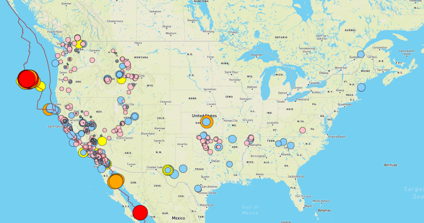
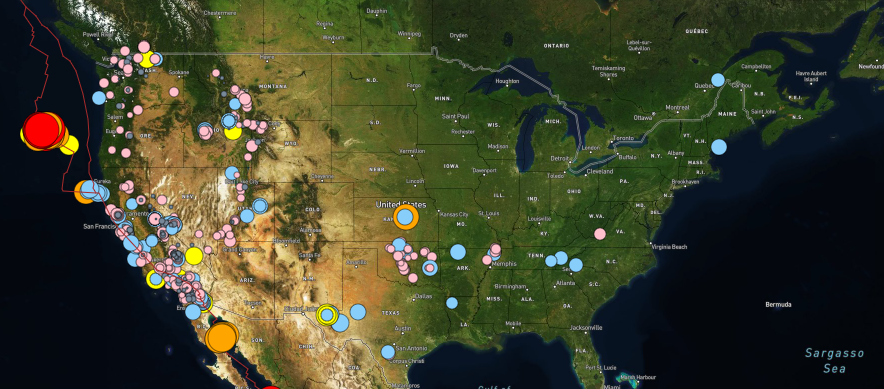
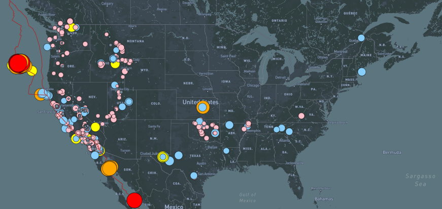
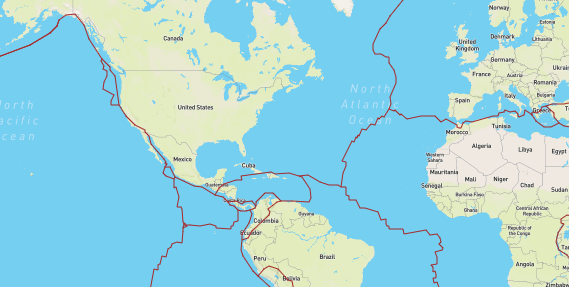

# Earthquakes_Mapping
## javaScript-Leaflet ,HTML, D3 json

**Overview of Project:**

In this project I have collected the earthquakes data recorded for the past week from the USGS using an API key, I have used JavaScript leaflet library to plot the earthquakes using the coordinates of the location. I have created 3 layers in the map.

Layer 1(All Earthquakes) this layer shows earthquakes of all magnitude mild to severe earthquakes.

Layer 2(Tectonic Plates) I have added a layer that shows tectonic plates because earthquakes occur along fault lines, cracks in Earth's crust where tectonic plates meet. They occur where plates are subducting, spreading, slipping, or colliding, this layer shows all the tectonic plates in the map. 

Layer 3 (Major Earthquakes) Events with magnitudes greater than 4.5 are strong enough to be recorded by a seismograph anywhere in the world and considered as a serious earthquake, this layer shows all earthquakes over magnitude.

The marker color and size show the severity of the earthquake, Earthquakes with magnitude 4.5 and over are marked red and bigger than other markers. 

**Results:**

In this project I have used JavaScript – Leaflet in combination with d3json to read the json data format data as these 2 libraries are very efficient in parsing the json data format. I have plotted all earthquakes and created an interactive map (link below)

